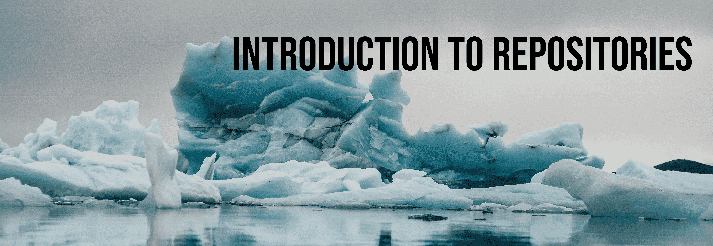
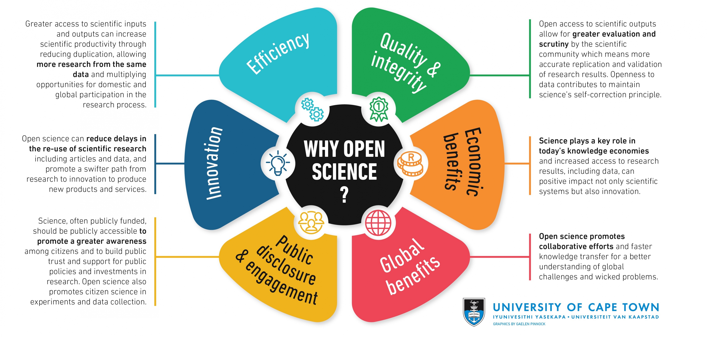

--------------

#### **Goals**: 

- Define "data repository" 
- Explain how repositories are used and and why they are important.
- Understand how data repositories support a culture of open science

---------------

#### **Instructors Guide **

[View the slides here.](https://docs.google.com/presentation/d/1zLSrdq8cbPZgyfmctebp4hTohp3asbItm5DXeDN6pFI/edit?usp=sharing)

Introduce the lesson and **ask students,** what are data? 

For reference:

* Wikipedia - Data are characteristics or information, usually numerical, that are collected through observation.[1] In a more technical sense, data is a set of values of qualitative or quantitative variables about one or more persons or objects, while a datum (singular of data) is a single value of a single variable. [2]

* MerriamWebster - Factual information (such as measurements or statistics) used as a basis for reasoning, discussion, or calculation
Tech terms - Computer data is information processed or stored by a computer. This information may be in the form of text documents, images, audio clips, software programs, or other types of data. 

* Dictionary.com - A plural of datum. Datum: A single piece of information, as a fact, statistic, or code; an item of data. In Philosophy 1) any fact assumed to be a matter of direct observation. 2) Any proposition assumed or given, from which conclusions may be drawn.

---------------

**Ask students** to provide examples of data from their daily life or from their own course work. 

The world today is filled with science news, from climate change to hurricanes – and it all affects the people inhabiting the earth. The label “data” is all-encompassing and can be categorized in several ways. These graphics help us classify types of data.

---------------

**Ask students** to think of some data related to any of these categories. Then to try and define a data repository.

Some leading questions: 

* Libraries store books, repositories store ____.
* Where does data go? 
* What is the "cloud"?

The amount of available storage is not keeping up with the amount of data flooding in daily. How do we decide what data we keep?

---------------

**Ask students** to discuss where data from research seem to end up. Since we already introduced repositories in the earlier slide, this question is not necessarily meant to reinforce the concept. Rather, what we want the students to get at is where do they think data from research typically goes and how does that fit into the scientific process.

Because researchers require time to verify data, analyze their data, and derive research conclusions, individual researchers generally are not expected to make all their data public immediately. 

New tools for automatically assessing the quality of data and sharing them with others can facilitate the rapid sharing of digital data, although verifying the reliability of these tools presents its own set of challenges.

Once a research result is published, the norms of science—and often the terms of the research grant or contract—call for the supporting data to be accessible. 

Researchers may nevertheless try to keep the data private, perhaps to derive additional results without competition from others, for the exclusive use of a student or postdoctoral fellow whose career would be advanced by generating further papers, or just to avoid the effort to put the data in a usable form for others. In the worst cases, they may retain data to hide acts of research misconduct or to conceal defects in the dataset. 

Sometimes researchers may want to keep the data private just out of respect for the type of data collected. Some data contains sensitive information such as people’s names, racial or ethnic origin, political opinions, religious or philosophical beliefs.

The norms of a research community may allow keeping data private for a certain period. These norms can be formalized through the terms of a grant-giving the investigator a defined period of exclusive use of the data, with the exclusivity ending upon the publication of results, after a particular length of time, or when data are deposited in a data center or archive.

There is great variation among research fields in their data-sharing norms, to such an extent that different fields can be said to have different data cultures.

Given the numerous ways data can be lost and thereby irrevocably damage the integrity and reproducibility of the associated research, this is exactly why researchers should have a plan in mind for their data.

---------------

Let’s circle back to repositories now that we’ve explained the potential “why” for their use. Repositories have become a significant component of the infrastructure for research data. A repository is both a system and set of services designed as an archive for digital data with context, fixity, and persistence. In addition to data, repositories maintain and preserve metadata.

**Ask students** to find a data repository online in groups then share their findings with the class. 

Good starting point [here](https://www.nsf.gov/geo/oce/oce-data-sample-repository-list.jsp) or [here](http://re3data.org/).

Key objectives from the activity: 

* Develop an understanding for how diverse repositories are
* Practice finding a repository for different data types

While we might have come up with what a repository is as a class, now take a moment to explicitly define the uses of data repository.

Data repositories provide: 

* Easy information discovery  
* Easy and efficient access  
* More exposure and amplify impact  
* Persistent access (through persistent URL)  
* Long-term storage and preservation

---------------

Now that we have established why using a repository is important, we want to then tie this into the philosophy of open science. 

Open science is the movement to make scientific research and data accessible to all. In many ways, the reasons why we should store scientific data in a repository are the same reasons why we should embrace the culture of open science. 

**Optional Additional Materials**

* Video on [Open Science](https://www.youtube.com/watch?v=3m6p6w8oOw4) (4 minutes)
*	TedTalk, “[Open Science can save the world](https://www.youtube.com/watch?v=uPtP6-nAjJ0)” (13 minutes)
*	ACRL Presents: [Open Data Repositories-Creating Equitable and Sustainable Data Access](https://www.youtube.com/watch?v=xaAh4PfPdRs) (50 minutes)
